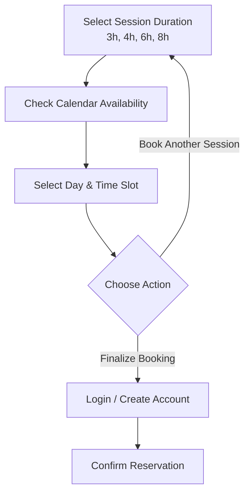

# Project Proposal & Requirements Specification: Tattooplatz Digital Ecosystem
**Website Redesign & Custom Booking Tool Development**

---

## 1. Executive Summary

**Tattooplatz Zürich** is an innovative co-working tattoo studio based in Zurich, Switzerland, catering to a global network of guest tattoo artists. The current digital presence relies on Wix for the website/shop and SimplyBook for station booking. 

This document outlines the requirements and proposed technical architecture to transition Tattooplatz to a **custom, premium digital ecosystem**. This includes a completely redesigned frontend website, a custom-built e-commerce shop, a bespoke booking engine tailored to co-working station rentals, database migration, and a roadmap for AI-powered social media automation.

---

## 2. Core Project Objectives

1. **Brand Modernization**: Rebuild the public website into a premium, responsive web application reflecting the studio’s unique aesthetic.
2. **Custom Booking Engine**: Replace SimplyBook with a tailor-made system designed around co-working station logistics (hourly/session rentals).
3. **E-Commerce Rebuild**: Migrate the existing Wix Merchandise shop containing the studio's custom product lines to a modern checkout system (e.g., Stripe Checkout, Shopify Headless, or Payload CMS).
4. **Seamless Data Migration**: Migrate all existing customers, history, and scheduled appointments from SimplyBook.
5. **Instagram Automation**: Plan for future AI chatbots to facilitate direct booking via Instagram Direct Messages.

---

## 3. Brand Identity & Design System
*Derived from `Web Tattooplatz Design (2).pdf` & `website_pics/image.png`*

### Color Palette
The UI will adhere to a high-contrast, bold, modern punk-chic color scheme:
- **Primary Color (Backgrounds/Text)**: `#FFFFFF` (White)
- **Secondary Color (Structural/Text)**: `#000000` (Black)
- **Accent Color (Key CTAs/Highlights)**: `#FF66C4` (Vibrant Neon Pink)
- **Highlight Color (Secondary Accents)**: `#F4B6DE` (Soft Pastel Pink)

### Typography & Imagery
- High-impact, uppercase sans-serif headers (e.g., *Outfit*, *Inter*, or *Montserrat*).
- Clean, minimal layouts utilizing raw photography of the studio, artist stations, and neon signage.

---

## 4. Website Requirements & Content Mapping
*Based on layout in `Web Tattooplatz Design (2).pdf` and screenshots from `website_pics`*

### Page Architecture & Layouts
1. **Hero Section**:
   - Tagline: "Tattoo Workstations, Hourly Rent, Fair Prices, On-site Payment"
   - Prominent Neon Pink CTA: "BOOK HERE" leading to the Booking Engine.
2. **Co-Working Process (3-Step Guide)**:
   - **Step 1**: Book your agenda (Select required hours in the booking tool).
   - **Step 2**: Reserve the specific station slot.
   - **Step 3**: Enjoy our studio free and with no commission deductions (WE DO NOT TAKE INCOME PERCENTAGES).
3. **What is Included**:
   - *Included materials*: Paper towels, standard printer, 2 stencil printers, stencil printer paper, surface disinfectant, coffee machine.
   - *Artist requirements*: Artists must bring their own tattoo machine, needles, colors, and any other personal supplies.
4. **Work Visa Information**:
   - Interactive, localized widget for traveling guest artists:
     - *EU Citizens*: Direct link to the official registration portal (easygov.swiss).
     - *Non-EU Citizens*: Dynamic contact link prompting direct contact with the legal department (via Instagram/Email).
5. **Pricing Matrix**:
   - *Note: Discrepancy observed between design PDF (170 CHF) and current Wix live site (180 CHF) for 6 Hours. Stated Wix prices below:*
     - **3-Hour Session**: `90.00 CHF`
     - **4-Hour Session**: `120.00 CHF`
     - **6-Hour Session**: `180.00 CHF`
     - **8-Hour Session**: `220.00 CHF`
6. **References & Testimonials**:
   - Highlighted reviews from guest artists:
     - *Joao Otereze (Tattoo Artist)*: "A great tattoo studio! The design is just incredibly cool... The founders are super sympathetic."
     - *Philipp Engel (Tattoo Artist)*: German testimonial detailing the studio's excellent flair and client care.
     - *Julia W. (Tattoo Customer)*: Review highlighting the premium city views from the tattoo chairs.
7. **Our Mission**:
   - Detailed text describing the co-working philosophy (100% earnings retention, fully equipped stations, location advantage: 5-minute walk from Altstetten train station).
8. **Team Grid**:
   - Bio profiles for the core team:
     - *Chris* (Co-Founder)
     - *Tuli* (Co-Founder)
     - *Bea* (Content Creator & Studio Manager)
9. **Merchandise Store**:
   - Migrate and redesign their active "Vulva Edition" and "Minimal Edition" apparel catalog.
   - *Featured Products*: Pajamas (45.00 CHF), Socks (17.50 CHF), Mugs (15.00 CHF), Denim T-Shirts (35.00 CHF), Crop Hoodies (55.00 CHF), Zip Hoodies (65.00 CHF), and Embroidered Polos (55.00 CHF).
10. **Footer & Contact**:
    - Opening Hours: Wednesday to Sunday, 11:00 AM to 7:00 PM.
    - Email contact form with email verification.
    - Embed map for Aargauerstrasse 180, 8048 Zürich.
    - Social links (@tattooplatz_zurich).

---

## 5. Custom Booking Tool Specifications
*Derived from `Booking Tool Guide (1).pdf` and `website_pics/image copy.png`*

Unlike standard booking tools that book services (e.g., booking a specific haircut), the Tattooplatz system must function as a **space-rental booking engine**. It books physical co-working stations.

### Client-Side Booking Flow


1. **Duration Selection**: 
   - Artists select the number of hours they wish to book (minimum 2 hours, standard durations of 3, 4, 6, 8 hours).
2. **Calendar Availability Logic**:
   - The calendar shows days. If a day has no available blocks that can accommodate the chosen duration across any of the active stations, that day is marked "Unavailable".
   - *Example*: If the user selects an 8-hour session, but all stations only have scattered 2-hour blocks, that day is blocked out.
3. **Daily Schedule View**:
   - Selecting an available day displays a detailed timeline (opening hours: 11:00 AM - 7:00 PM, or adjustable).
   - Shows free vs. booked slots.
   - **Privacy Rule**: Timeline shows occupied blocks but *does not* expose artist names or customer booking details.
   - Multiple stations (initially 4 stations, database schema must support dynamically adding/removing stations) are tracked parallelly.
4. **Multi-Session Booking**:
   - After selecting a slot, the user is prompted to either "Finalize Booking" or "Book Another Session".
   - Cart-like system allows booking multiple sessions across different days in a single checkout checkout flow.
5. **Customer Accounts**:
   - Registration is integrated into the finalization checkout step. New customers automatically have an account generated.
   - Personal Portal: Artists can log in, view their calendar of past/upcoming bookings, and manage active reservations.

### Admin-Side Features
1. **Station Management**: Expand or contract the number of bookable stations (e.g., scale from 4 to 6 stations).
2. **Opening Hours Manager**: Flexible rules to adjust opening/closing times per day, including holidays.
3. **Central Booking Calendar**: Visual master calendar showcasing all stations, occupied slots, and client identities.
4. **Reservation Management**: Ability for admin to manually add, move (reschedule), or cancel bookings.
5. **Block Out Feature**: Quick tool to block specific stations, days, or hours for maintenance, guest spots, or events.

---

## 6. Data Migration Plan (SimplyBook ➔ Custom Database)

To prevent business disruption, a structured migration pipeline is required:
1. **Data Export**: Extract database records from SimplyBook using their API or standard CSV exports.
   - *Target datasets*: Customer Profiles (Names, Emails, Phone numbers), Booking History, and Future Scheduled Appointments.
2. **Data Mapping**: Align SimplyBook schema structure to the new custom database (e.g., mapping SimplyBook "resources" to physical "Stations").
3. **Dry-Run Import**: Import to a staging environment to verify appointment dates, time zone alignments, and prevent booking overlaps.
4. **Production Cutover**: Execute the final import immediately before launching the new system to capture bookings made up to the last minute.

---

## 7. AI Instagram Messenger Integration (Future Phase)

### Technical Feasibility Analysis
**Yes, this is highly feasible.** Using the Meta Graph API (Messenger) combined with an AI Orchestration layer, we can create a automated booking agent.

```
[Artist on Instagram] ➔ [Instagram Direct Message]
                                 │
                                 ▼
                     [Meta Messenger Webhook]
                                 │
                                 ▼
                    [AI Agent / NLP Engine] ◄──► [Tattooplatz Database API]
                     (Understand intent,          (Fetch free slots)
                      verify availability)
                                 │
                                 ▼
                 [Auto-Book Slot or Send Link]
```

#### How it works:
1. **NLP Processing**: The chatbot detects when an artist is asking to book a guest spot.
2. **Real-time Querying**: The bot calls the Custom Booking Tool API to check availability for the requested dates/hours.
3. **Conversational Booking**: 
   - The bot responds: *"We have Station 2 open on Wednesday from 11:00 AM to 5:00 PM. Would you like to reserve this?"*
   - Once confirmed, the bot issues a unique booking link to finalize payment, or registers them directly in the database and sends a confirmation email.
4. **Platform Limit Warning**: To avoid API violations, the chatbot must adhere strictly to Meta's developer policies (24-hour messaging window, customer consent).

---

## 8. Development Timeline Estimate

| Phase | Description | Deliverables | Estimated Duration |
| :--- | :--- | :--- | :--- |
| **Phase 1: Design & Architecture** | Wireframing UI/UX, database schema design, migration mapping. | Interactive mockups, database ERD. | 2 Weeks |
| **Phase 2: Website Frontend & Shop** | Rebuilding the Wix website and catalog into a modern, fast Next.js responsive app with e-commerce. | Static pages, merchandise store frontend. | 4 - 5 Weeks |
| **Phase 3: Booking Engine & Portal** | Developing calendar logic, user authentication, customer & admin dashboards. | Functional booking tool, admin console. | 6 - 8 Weeks |
| **Phase 4: Migration & Integration** | Migrating SimplyBook records, connecting website to booking tool. | Migrated database, integrated system. | 1 - 2 Weeks |
| **Phase 5: Testing & Launch** | Double-booking prevention stress tests, payment integrations, launch. | Live, operational web app. | 2 Weeks |
| **Total Estimated Timeline** | | | **15 - 19 Weeks** (Approx. 4-5 Months) |

---

## 9. Budget & Cost Estimation

*Note: Estimates are structured as industry-standard rates for custom software engineering and enterprise-grade design.*

| Item / Service | Scope & Details | Price Range (CHF / USD) |
| :--- | :--- | :--- |
| **Website & E-Commerce Redesign** | Custom Next.js frontend, interactive visa widget, team grids, shop migration for Vulva/Minimal product lines, Stripe payment gateway. | **$6,500 - $9,500** |
| **Bespoke Booking Engine** | Dynamic availability algorithm, station allocations, client account system, multi-session logic, admin portal. | **$12,000 - $18,000** |
| **Data Migration** | Safely migrating customer data & upcoming slots from SimplyBook. | **$1,500 - $3,000** |
| **Total Core Project** | **Complete Website + Shop + Booking Tool + Migration** | **$20,000 - $30,500** |
| *Optional: Instagram AI Bot* | Phase 2 add-on: Meta API integration, LLM assistant setup, booking tool sync. | *$4,000 - $7,000* |

---

## 10. Ongoing Support & Maintenance Model

To ensure 99.9% uptime, security patch applications, and immediate troubleshooting, we recommend a monthly SLA (Service Level Agreement):

1. **Basic SLA ($300 / month)**:
   - Hosting management (Vercel/AWS/Supabase monitoring).
   - Automated database backups.
   - SSL certificate renewals & core library updates.
   - Up to 2 hours of developer support for minor tweaks.
2. **Professional SLA ($800 / month)**:
   - All Basic SLA features.
   - Priority 24-hour response time for critical bugs.
   - Performance audits & optimizations.
   - Up to 7 hours of developer support for text updates, design edits, or adding new features.
3. **Ad-hoc Developer Hourly Rate**: **$120 / hour** for out-of-scope customization requests.
